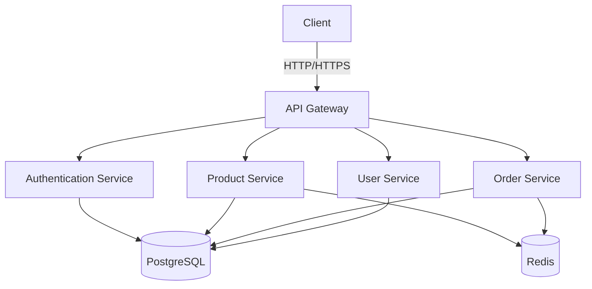

# System Architecture

## High-Level Overview



## Core Components

1. **API Layer**

   - **Django REST Framework**: For RESTful API endpoints
   - **Graphene-Django**: For GraphQL API
   - **Authentication**: JWT with refresh tokens
   - **Rate Limiting**: Protection against abuse
   - **CORS**: Secure cross-origin requests

2. **Service Layer**

   - **Product Service**: Manages product catalog, inventory
   - **Order Service**: Handles order processing
   - **User Service**: User management and authentication
   - **Payment Service**: Payment processing (integrated with payment gateways)

3. Data Layer

    - **PostgreSQ**L: Primary data store
    - **Redis**: Caching and message brokering
    - **Elasticsearch**: Full-text search (optional)

## Data Flow

1. **User Authentication**:

    ```text
    Client → API Gateway → Auth Service → (JWT Token) → Client
    ```

2. **Product Browsing**:

    ```text
    Client → API Gateway → Product Service → (Cached) → Database
    ```

3. **Order Processing**:

    ```text
    Client → API Gateway → Order Service → (Async Task) → Payment Service
    ```

## Scalability Considerations

- Horizontal Scaling: Stateless services allow easy scaling
- Database: Read replicas for read-heavy operations
- Caching: Multi-level caching strategy
- Async Processing: Offload long-running tasks to Celery workers
